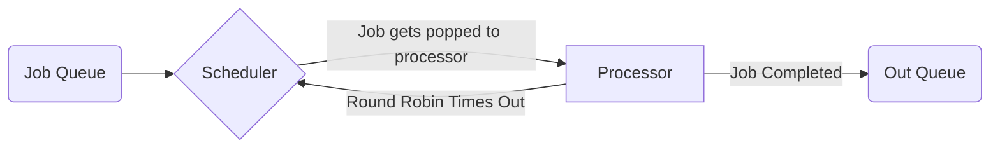

# Design Document

by Alyssa Hove, Rian Fiantozzi, and Linh Dang

# Document history 

|Revision Number |  Version      | Revision History | Date  |
| ---------------| ------------- |:-------------:| -----:|
| 1         | 0.1 Beta | Only Round Robin algorithm | 9/30/18 |

## 1. Introduction

This project is made to simulate an operating system by allowing multiple algorithms to be switched out. 

## 1.1 Purpose

<d2>
<dd> To be able to simulate an operating system and to allow others to learn how different algorithms effect the system <dd/>
<d2/>

## 1.2 Methodology
We used an object oriented methodology, with each part of the operating system being kept separate from the rest. This will allow for future projects to more easily modify the behavior of the operating system and maintain constant auditing logs.  It also allows for the hot switching of different scheduling algorthims and methods of handling processes within the same audit session
### Round Robin 

## 2. System needs

### 2.1 CMake and C++ 
<d1>
  <dt> Properties needed to run simulation<dt/>
  <dd> CMake version: 3.11 <dd/>
  <dd> C++ version: C++14 <dd/>
<d1/>
<d1> 
<dt> Toolchain<dt/>
<dd>gcc  7.3.0-3<dd/>
<dd>g++7.3.0-3<dd/>
<dd>`make` 3.6.2-1<dd/>
<d1/>

## 3.

